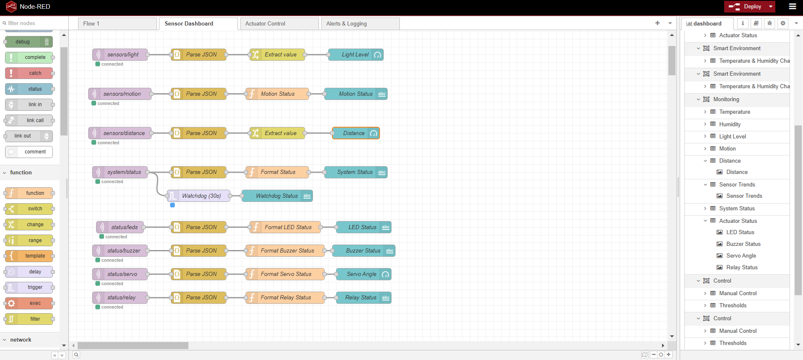
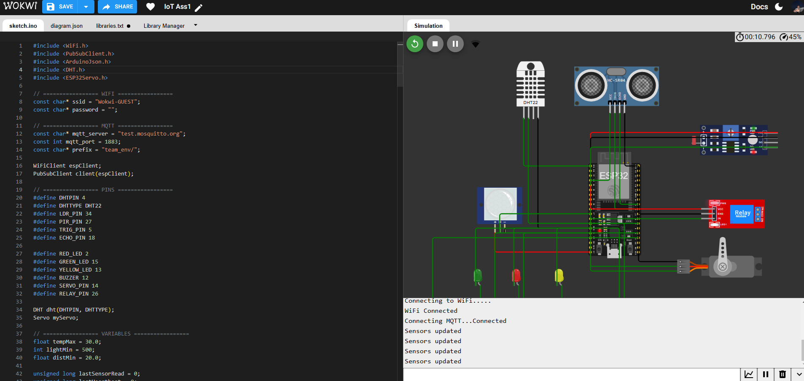

# Smart Environment Monitoring & Control System

IoT course assignment 1 for SWAPD 453, Spring 2026.

Team members:
- Ahmed Sameh
- Hesham Ashraf

## Overview

This project implements a smart environment monitoring and control system using an ESP32, multiple sensors, MQTT communication, and a Node-RED dashboard. The ESP32 collects real-time environmental data and publishes it as JSON messages. Based on configurable thresholds and manual dashboard commands, the system controls several actuators.

The project was developed and tested in Wokwi for the ESP32 side, with Node-RED used for dashboard visualization and control.

## Implemented Hardware

Sensors:
- DHT22 for temperature and humidity
- LDR for ambient light level
- PIR sensor for motion detection
- HC-SR04 ultrasonic sensor for distance measurement

Actuators:
- Red LED
- Green LED
- Yellow LED
- Buzzer
- Servo motor
- Relay module

## Main Features

- Reads temperature, humidity, light, motion, and distance values from the ESP32.
- Publishes sensor readings through MQTT in JSON format.
- Supports automatic control rules on the ESP32:
  - Red LED turns on when temperature exceeds the configured threshold.
  - Yellow LED turns on when light drops below the configured threshold.
  - Buzzer turns on for 2 seconds when motion is detected.
  - Servo opens when distance is below the configured threshold.
- Supports manual override from the dashboard for LEDs, buzzer, servo, and relay.
- Supports runtime threshold updates through MQTT without restarting the ESP32.
- Publishes system heartbeat and ESP32 status information.

## Project Structure

- `ESP32-code/sketch.ino`: Main ESP32 firmware
- `ESP32-code/diagram.json`: Wokwi wiring diagram
- `ESP32-code/libraries.txt`: Required Arduino libraries
- `ESP32-code/wokwi-project.txt`: Wokwi project metadata
- `flows.json`: Exported Node-RED flow file currently included in the repository
- `Screenshots/`: Dashboard and project screenshots
- `Ass1-Iot-Demo video.mp4`: Local demo video

## ESP32 Logic Summary

The ESP32 firmware handles:

- Wi-Fi connection using the Wokwi guest network
- MQTT communication using `PubSubClient`
- JSON serialization and deserialization using `ArduinoJson`
- Periodic sensor reads every 2 seconds
- Heartbeat publishing every 10 seconds
- MQTT subscriptions for actuator and threshold commands
- Automatic and manual actuator control modes

## MQTT Topics

The current firmware uses the prefix `team_env/` before every topic.

Published topics:
- `team_env/sensors/temperature`
- `team_env/sensors/humidity`
- `team_env/sensors/light`
- `team_env/sensors/motion`
- `team_env/sensors/distance`
- `team_env/system/status`

Subscribed topics:
- `team_env/actuators/led`
- `team_env/actuators/buzzer`
- `team_env/actuators/servo`
- `team_env/actuators/relay`
- `team_env/config/thresholds`

Example threshold payload:

```json
{
  "temp_max": 30,
  "light_min": 500,
  "dist_min": 20
}
```

## Pin Mapping

- DHT22: GPIO 4
- LDR analog output: GPIO 34
- PIR output: GPIO 27
- HC-SR04 trig: GPIO 5
- HC-SR04 echo: GPIO 18
- Red LED: GPIO 2
- Green LED: GPIO 15
- Yellow LED: GPIO 13
- Buzzer: GPIO 12
- Servo: GPIO 14
- Relay: GPIO 26

## Required Libraries

From `ESP32-code/libraries.txt`:

- DHT sensor library for ESPx
- PubSubClient
- ArduinoJson
- ESP32Servo

## How To Run

### ESP32 Simulation

1. Open the ESP32 code and Wokwi diagram from the `ESP32-code` folder.
2. Install the Arduino libraries listed in `libraries.txt`.
3. Start the simulation.
4. Open the Serial Monitor to confirm Wi-Fi and MQTT connection.

### Node-RED

1. Import the Node-RED flow JSON.
2. Configure MQTT nodes to match the broker and topic prefix used by the ESP32.
3. Open the dashboard.
4. Verify live sensor values and test actuator controls.

## Screenshots

### Dashboard And Project Images






## Demo Video

- Google Drive demo: https://drive.google.com/file/d/1iQA6yTD2n1xcSYEkaDMHUYja5BnvGkQY/view?usp=sharing
- Local repository video: [Ass1-Iot-Demo video.mp4](Ass1-Iot-Demo%20video.mp4)

## Testing

The project can be tested using the following checks:

- Confirm that the ESP32 connects to Wi-Fi and the MQTT broker.
- Verify that temperature, humidity, light, motion, and distance values are published every 2 seconds.
- Confirm automatic actuator behavior by changing simulated sensor conditions in Wokwi.
- Test manual override from the Node-RED dashboard for LEDs, buzzer, servo, and relay.
- Update thresholds from the dashboard and verify they are applied immediately.
- Check heartbeat updates on `team_env/system/status` every 10 seconds.
- Compare the live behavior against the attached screenshots and the demo video.

## Notes

- The firmware uses `test.mosquitto.org` as the MQTT broker.
- The DHT sensor used in the implementation is DHT22, which is acceptable in the assignment.
- The repository includes Wokwi hardware files and dashboard screenshots for documentation.

## Submission Note

This repository contains the ESP32 code, wiring diagram, screenshots, and demo video. If this repository is used for final submission, the complete exported Node-RED flow and a short report should also be included in the final deliverables package if they are not already available elsewhere.
